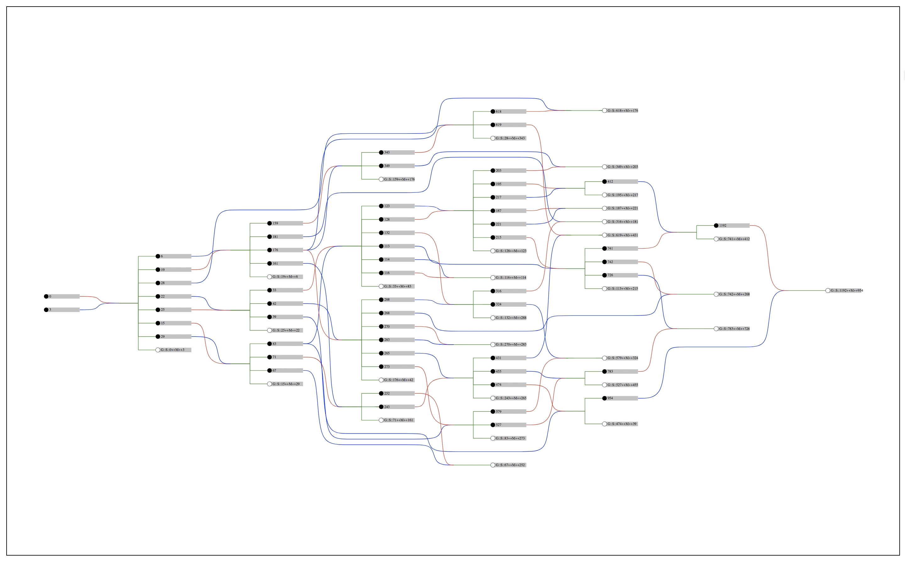
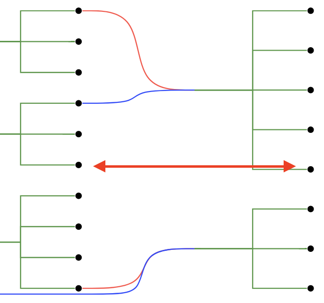
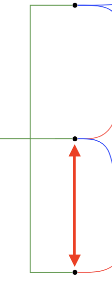
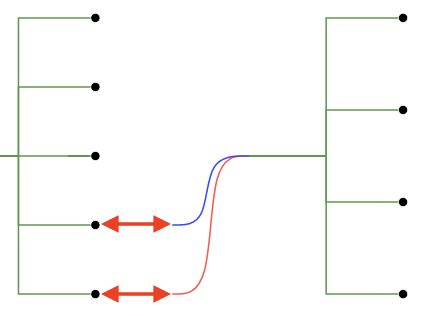
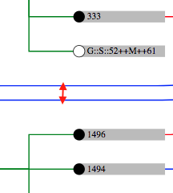

# d3-pedigree-tree



D3-Pedigree-Tree is a [D3.js]() plugin which adds a layout for visualizing multi-parental trees ([DAG](https://en.wikipedia.org/wiki/Directed_acyclic_graph)s) as pedigree trees with grouped siblings. It was developed in order to ease the visualization of complicated pedigree trees.

#### Sorting

D3-Pedigree-Tree sorts pedigree trees (grouping by siblings). In order to do this, it uses an iterative (hill-climbing) algorithm which repositions node according to the average positions of their parents and children. Running the sort algorithm multiple times results in a tree which has shorter edges and fewer intersections than random placement. The following example shows 20 iterations of the algorithm (2.5 per second.)


#### Transformations

All layout information is returned with X/Y coordindates. As such, a vertically-oriented pedigree tree can be created by simply flipping the X and Y coordinates. To ease more complicated transformations, the X-range and Y-range are returned in the resulting layout object.

## Installing

If you use NPM, `npm install @solgenomics/d3-pedigree-tree`. Otherwise, download the [latest release](https://github.com/d3/d3-pedigree-tree/releases/latest).

## API Reference

<a href="#pedigree-tree" name="pedigree-tree">#</a> d3.**pedigreeTree**()  
Constructs a new pedigree-tree layout with the default settings.

<a href="#pedigree-tree-instance" name="pedigree-tree-instance">#</a> _pedigreeTree_()   
Returns the resulting layout object according to the settings made for the data provided. This information is formated as follows:  
###### Layout format
```javascript
/*** Main Object ***/
{
  'links':[link1,link2,...,link3], // list of all links in layout (see linktypes)
  'nodes':[node1,node2,...,node3], // list of all nodes in layout (see nodetypes)
  'x':[xMin,xMax], // minimum and maximum x coordinate in layout
  'y':[yMin,yMax], // minimum and maximum y coordinate in layout
  'pdgtree': function pdgtree(){} // reference to the function which created this object.
}

/*** Linktypes ***/
[
  {
    'type':"parent->mid", // represents edges emanating from parents (red&blue in the example above.)
    'source': {}, // reference to the parent node.
    'sinks': [{},...,{}], // references to children in the linked sibling group
    'id': 'LINK::*-->--*', // id for this link that can be used to maintain object constancy.
    'path': [[x,y],[x,y],[x,y]] // list of points in the link's generated path. (this can be passed to a d3.line() function)
  },
  {
    'type':"mid->child", // represents edges ending in children (green in the example above.)
    'sources': [{},...,{}], // references to the parent nodes for the sibling group.
    'sink': {}, // reference to child linked.
    'id': 'LINK::*-->--*',
    'path': [[x,y],[x,y],[x,y]]
  }
]

/*** Nodetypes ***/
[
  {
    'type':'node', // object representing a normal node (black in the example above).
    'parents':[{},...,{}], // list of parent nodes.
    'children':[{},...,{}], // list of child nodes.
    'id': "", // id for this link that can be used to maintain object constancy as defined by pedigreeTree.id()
    'sib_group_id': "", // id shared by every child in a sibling group.
    'value': {}, // value as defined by pedigreeTree.value()
    'x': x, // x coordinate for this node
    'y': y  // y coordinate for this node
  },
  {
    'type':'nodeGroup', // object representing a grouped node (white in the example above).
    'parents':[{},...,{}], // list of parent nodes.
    'children':[], // always empty
    'id': "", // id for this link that can be used to maintain object constancy.
    'sib_group_id': "", // id shared by every child in a sibling group (and as such, every child in this grouped node).
    'value': [{},...,{}], // list of references to the node which are contained in this nodeGroup.
    'x': x, // x coordinate for this nodeGroup
    'y': y  // y coordinate for this nodeGroup
  }
]
```

<a href="#data" name="data">#</a> _pedigreeTree_.**data**(_array_)  
Sets an _array_ of objects (members) which will be used as the basis for constructing nodes. These will not be modified and will be accessible via node.value from the resulting node objects.

<a href="#id" name="id">#</a> _pedigreeTree_.**id**(_function_)  
Sets the the ID accessor. The _function_ is passed a [data member](#data) and should return an ID string. IDs will be used to insure nodes maintain [object constancy](https://bost.ocks.org/mike/constancy/). This function must always return the same ID if it is run multiple times on the same input.

<a href="#parents" name="parents">#</a> _pedigreeTree_.**parents**(_function_)  
Sets the the parents accessor. The _function_ is passed a [data member](#data) and should return the [data member](#data) which represents the parents node (or `null` if parentless).

<a href="#parents-ordered" name="parents-ordered">#</a> _pedigreeTree_.**parentsOrdered**(_boolean_)  
Sets whether or not the order of the parents returned by the [_pedigreeTree_.**parents**()](#parents) accessor should be taken into account when creating sibling groups. For example, it should be set to true if the accessor always returns the list as `[mother,father]`.

<a href="#value" name="value">#</a> _pedigreeTree_.**value**(_function_)  
Sets the the value accessor. The _function_ is passed a [data member](#data) and should return a value to be assigned as node.value. By default, the value is is [data member](#data) itself.

<a href="#iterations" name="iterations">#</a> _pedigreeTree_.**iterations**(_value_)  
Sets the maximum number of iterations of the sorting algorithm to perform. (See [Sorting](#sorting).)

<a href="#level-width" name="level-width">#</a> _pedigreeTree_.**levelWidth**(_value_)  
Sets the horizontal distance (in points) between levels of nodes.  


<a href="#node-padding" name="node-padding">#</a> _pedigreeTree_.**nodePadding**(_value_)  
Sets the minimum vertical distance (in points) from a node to its neighbors.  


<a href="#node-width" name="node-width">#</a> _pedigreeTree_.**nodeWidth**(_value_)  
Sets the horizontal distance (in points) nodes and the start of the outgoing edges. This allows for labels to be added to the nodes.   


<a href="#link-padding" name="link-padding">#</a> _pedigreeTree_.**linkPadding**(_value_)  
Sets the minimum verticle distance (in points) from a link to its neighbors.  


<a href="#group-childless" name="group-childless">#</a> _pedigreeTree_.**groupChildless**(_boolean_)  
Toggle grouping for childless nodes. If enabled, siblings without children will be collapsed into special grouped nodes. (See [Layout Format](#layout-format).)

<a href="#min-group-size" name="min-group-size">#</a> _pedigreeTree_.**minGroupSize**(_value_)  
Sets the minimum number of siblings required in order for them to be collapsed into a group.  

<a href="#exclude" name="exclude">#</a> _pedigreeTree_.**excludeFromGrouping**(_array_)  
Given an array of node ids, sets the layout such that those nodes will never be included in a group. 

<a href="#reset" name="reset">#</a> _pedigreeTree_.**resetGroups**()  
Resets the layout such that all nodes may be grouped if conditions are met. (Undoes [_pedigreeTree_.**excludeFromGrouping**()](#exclude))
